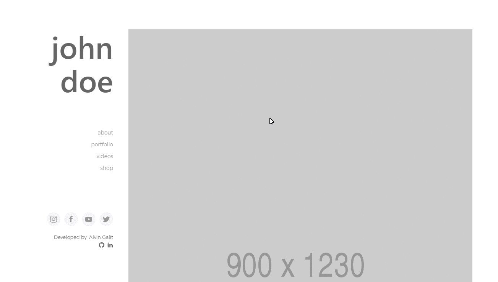
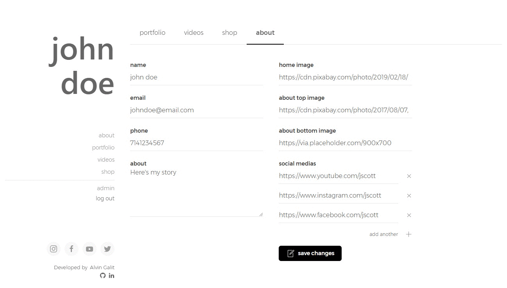

# Artist Web App
> A web application for an artist to show off his/her work and sell art.

This was a web application for an artist to upload his/her videos and artwork as well as sell his/her art. Visitors can view the artist's portfolio and videos and also purchase his/her artwork through paypal checkout.


## Demos
### Visitors can visit the the site and check out the about, portfolio, videos, and shop pages

### The artist will start off with a blank canvas and will set up his/her password

### He can then go to the **about** tab and update his/her information, contacts, and images and see the changes live



## User Stories

```
AS AN artist
I WANT a content management system web application that allows me to post my artwork and videos and also sell some art
SO THAT others can see my work in one place and support me as an artist
```


## Acceptance Criteria

```
GIVEN the application as a visitor
WHEN I arrive on the home screen
THEN I am presented with a sidebar for navigation and a large image of the artist
WHEN I click on the **about** link
THEN I am presented with a images, information, and contacts of the artist
WHEN I click on the **portfolio** link
THEN I am presented with a gallery of the artist's art works
WHEN I click on the **videos** link
THEN I am presented with videos that the artist uploaded
WHEN I click on the **shop** link
THEN I am presented with a list of art works that the artist is selling
WHEN I hover over each card in the **shop** page
THEN I see the *add to cart* button
WHEN I click the *add to cart* button
THEN it turns into *in cart* button and I can see a *cart icon* with the number of items I have in the cart
WHEN I click on the image on the card
THEN I am taken into a detail page and I'm able to add the item to the cart from there as well
WHEN I click on the *go to cart* link or the *cart icon*
THEN I am taken to the **shopping cart** page where I'm able to update my cart items and go through the paypal checkout
```


## Deployed Application
[Artist Web App](https://artist-web-app.herokuapp.com/)   

## Wireframes
   
  
  


