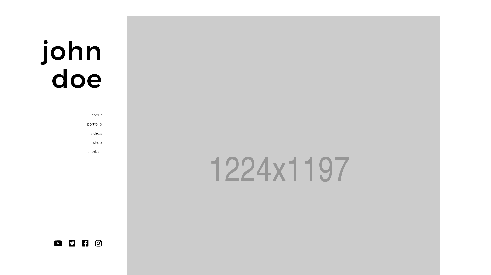
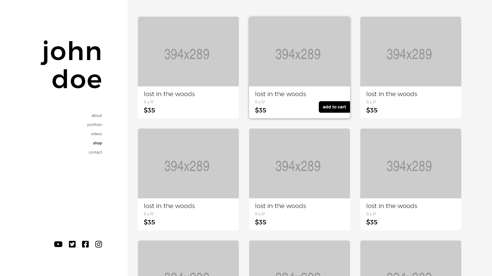
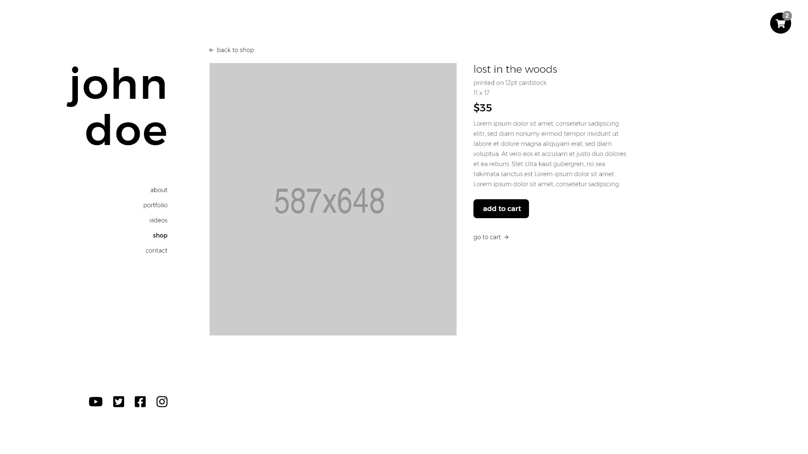
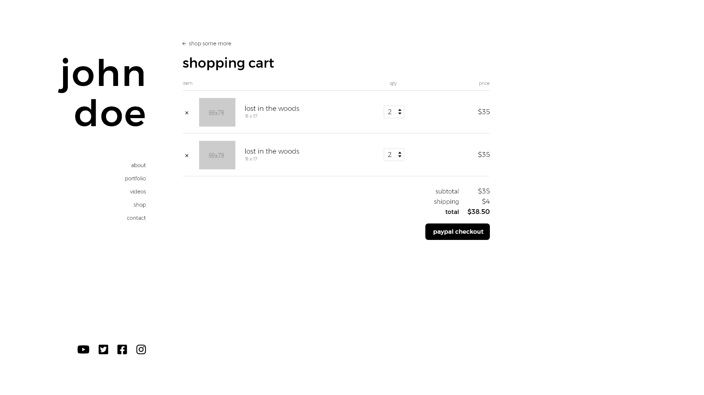
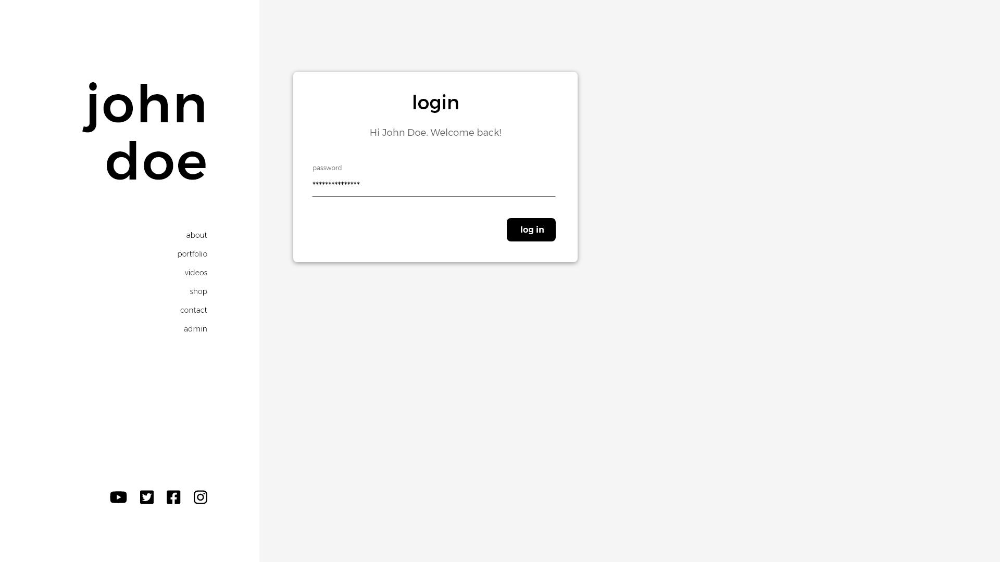
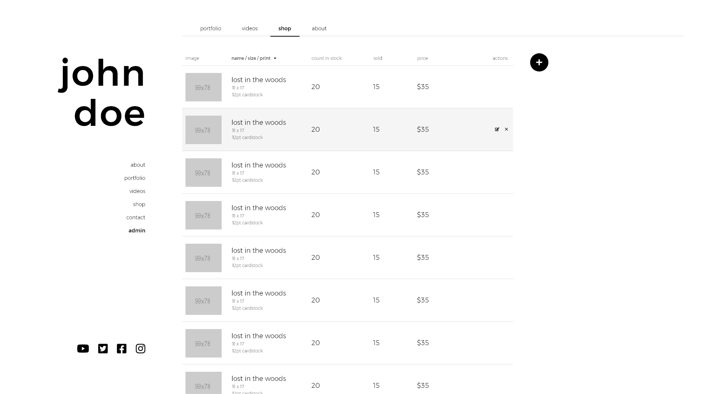
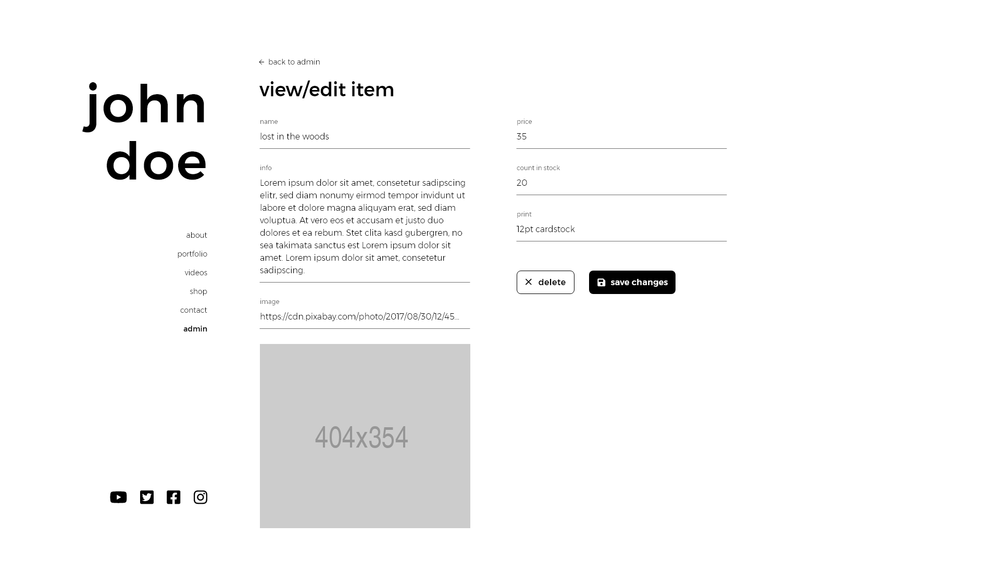
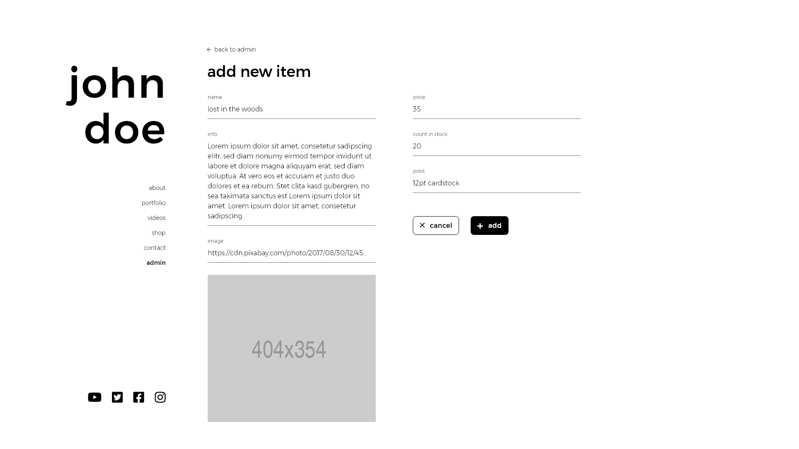

# Artist Web App
> A web application for an artist to show off his/her work and sell art.

This was a web application for an artist to upload his/her videos and artwork as well as sell his/her art. Visitors can view the artist's portfolio and videos and also purchase his/her artwork through paypal checkout.


## User Stories

```
AS AN artist
I WANT a content management system web application that allows me to post my artwork and videos and also sell some art
SO THAT others can see my work in one place and support me as an artist
```


## Acceptance Criteria

```
GIVEN the application as a visitor
WHEN I arrive on the home screen
THEN I am presented with a sidebar for navigation and a large image of the artist
...more to add
```

## Deployed Application


## Wireframes
   
  
  





