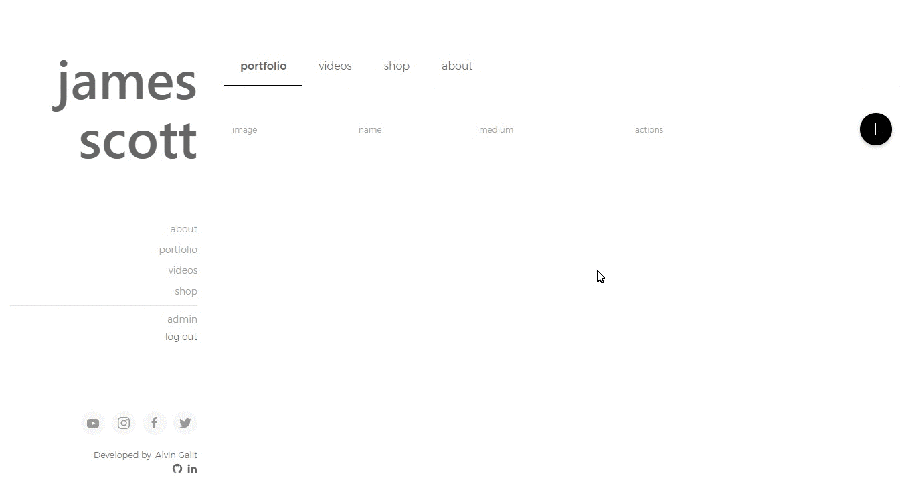
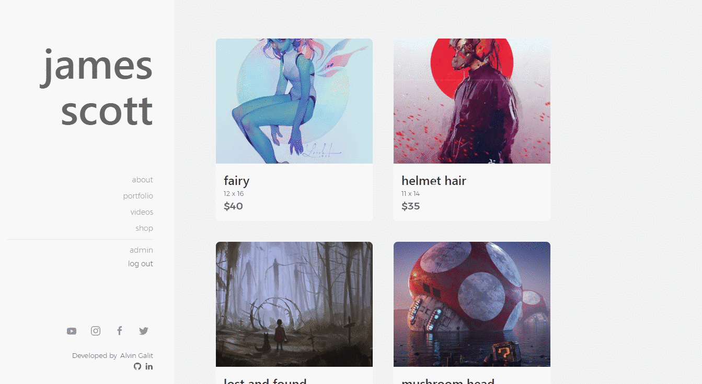

# Artist Web App
> A web application for an artist to show off his/her work and sell art.

This was a web application for an artist to upload his/her videos and artwork as well as sell his/her art. Visitors can view the artist's portfolio and videos and also purchase his/her artwork through paypal checkout.


## Deployed Application / Live Demo
[Artist Web App](https://artist-web-app.herokuapp.com/) 


## Demos / GIFs
Visitors can visit the the site and check out the about, portfolio, and videos pages as well as purchase some of the artist's artworks  


The artist will start off with a blank canvas and will set up his/her password  


After setting up the password, the artist can then go to the **about** tab and update his/her information, contacts, and images and see the changes live  


The artist can add items to his/her portfolio/videos/shop by clicking on the *plus* button and then filling out the form. The new item will then appear on the table once it has been added. 


The artist can delete an item from portfolio/videos/shop by hovering over the row and clicking on the *x* button.


The artist can update an item from portfolio/videos/shop by hovering over the row and clicking on the *edit* button.



## User Stories

```
AS AN artist
I WANT a content management system web application that allows me to post my artwork and videos and also sell some art
SO THAT others can see my work in one place and support me as an artist
```


## Acceptance Criteria

```
GIVEN the application as a visitor
WHEN I arrive on the home screen
THEN I am presented with a sidebar for navigation and a large image of the artist
WHEN I click on the **about** link
THEN I am presented with a images, information, and contacts of the artist
WHEN I click on the **portfolio** link
THEN I am presented with a gallery of the artist's art works
WHEN I click on the **videos** link
THEN I am presented with videos that the artist uploaded
WHEN I click on the **shop** link
THEN I am presented with a list of art works that the artist is selling
WHEN I hover over each card in the **shop** page
THEN I see the *add to cart* button
WHEN I click the *add to cart* button
THEN it turns into *in cart* button and I can see a *cart icon* with the number of items I have in the cart
WHEN I click on the image on the card
THEN I am taken into a detail page and I'm able to add the item to the cart from there as well
WHEN I click on the *go to cart* link or the *cart icon*
THEN I am taken to the **shopping cart** page where I'm able to update my cart items and go through the paypal checkout

GIVEN the application as the artist/owner
WHEN I browse through each page
THEN I am presented with a blank canvas with some placeholders in the home and about pages
WHEN I go to the */admin* route path
THEN I am presented with a form to create my password which then takes me to the admin page
WHEN I click on the **about** tab
THEN I can fill out a form to update my information with my name, contact info, images, and social media links and see a live update
WHEN I click on the *add* button on the other tabs
THEN I am presented with a from to fill out and submit
WHEN I go back to the admin pages
THEN I can see the item I just added
WHEN I hover a row
THEN I see my action buttons for *updating* and *deleting* the item
WHEN I click on the *delete* button
THEN I see that item removed from the table as well as the visitor's pages
WHEN I click on the *update* button
THEN I am taken back to a form with the fields auto-filled with the correct information of the item
WHEN I change some info on this form and click on the *save changes* button
THEN I can see the change in the admin table as well as the visitor's page
```
  

## Wireframes
   
  
  


